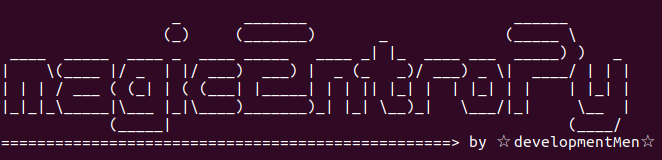
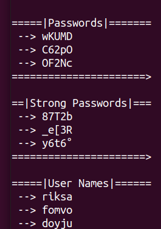
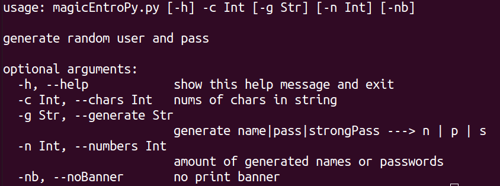

# MagicEntroPy

#### En la computación, la entropía es la aleatoriedad recogida por un sistema operativo o una aplicación para su uso. dentro de esta aleatoriedad se pueden crear contraseñas y usuarios como si de magia se tratase, y con ese pensamiento en mente nace magicEntroPy

## Como se usa?

|python3 magicEntroPy.py -c 5|

### help

